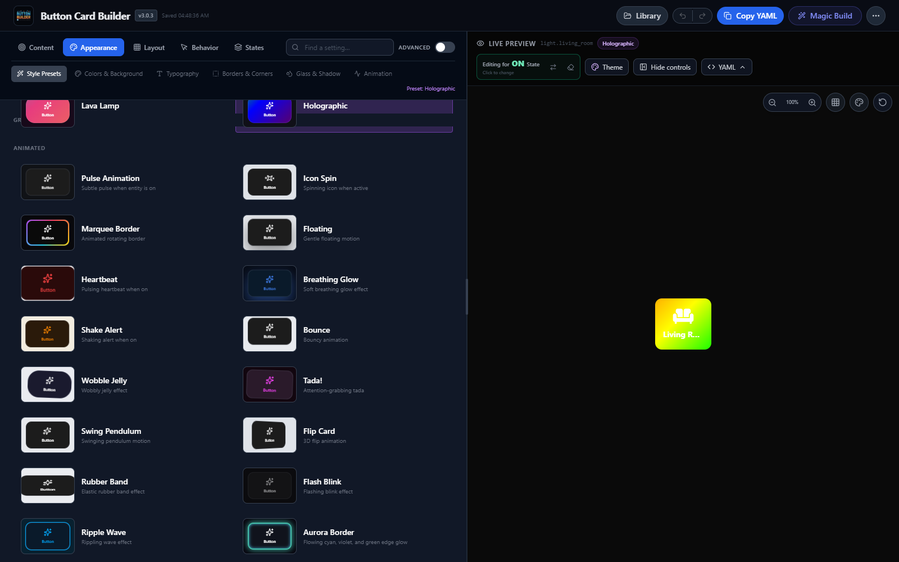

# Button Builder Wiki

Button Builder is a visual Home Assistant editor for creating `custom:button-card` YAML without hand-writing the full configuration.

Button Builder creates configurations for
[`custom:button-card`](https://github.com/custom-cards/button-card), created by
[RomRider](https://github.com/RomRider). Button Builder is a separate visual
configuration tool and would not exist without the flexibility of the original
button-card project.

> **Current release: 3.0.3** — This maintenance release restores animated
> preset backgrounds when ON/OFF state appearances are merged.

## Quick links

- [[Installation]]
- [[Getting Started]]
- [[What's New]]
- [[Configuration Options]]
- [[Style Presets]]
- [[Actions and Interactions]]
- [[Advanced Features]]
- [[Credits]]
- [[FAQ]]

## Version 3 highlights

- Independent ON/OFF state appearance editing
- Reusable global themes and custom style presets
- Curated preset/backdrop pairings
- More than two dozen visual effects with effect-specific intensity
- Home Assistant AI Task and direct Gemini generation
- YAML import/export and a dashboard-aware preview workbench

## Builder scope

Version 3 focuses this integration on `custom:button-card`. Bubble Card, Tile Card, and other builders are planned as separate integrations so they can be installed and released independently. Existing YAML already placed on dashboards is unaffected.

## Requirements

- Home Assistant 2024.1.0 or newer
- [`custom:button-card`](https://github.com/custom-cards/button-card)
- A modern browser

## Links

- [GitHub repository](https://github.com/aspenrt78/button-builder)
- [Releases](https://github.com/aspenrt78/button-builder/releases)
- [Report an issue](https://github.com/aspenrt78/button-builder/issues)
- [button-card documentation](https://github.com/custom-cards/button-card)
